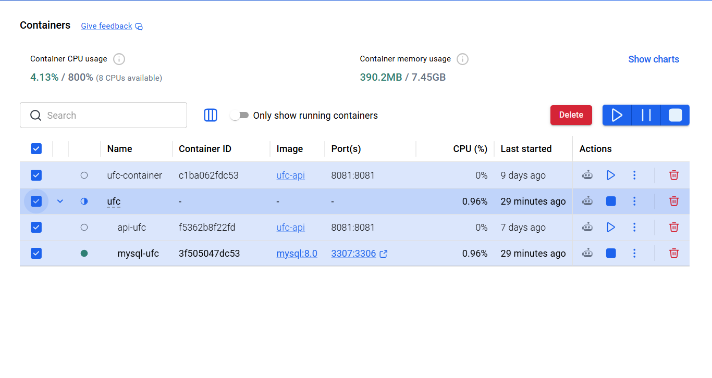
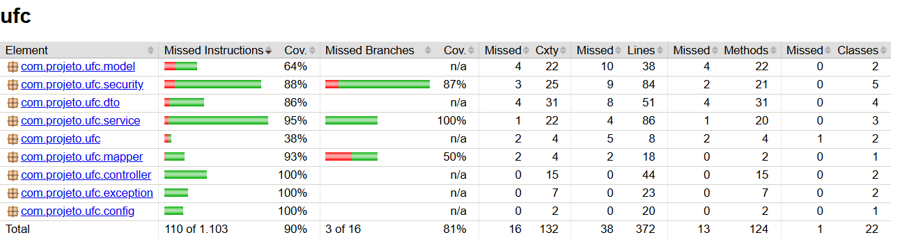
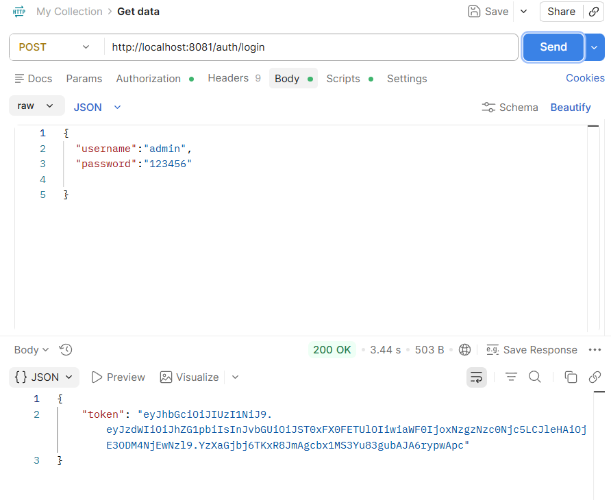

# 🥊 UFC API


API REST desenvolvida em **Java + Spring Boot** para gerenciamento de lutadores do UFC.

---

# 📚 Tecnologias

- Java 21
- Spring Boot
- Spring Security
- JWT
- MySQL
- Docker
- Swagger
- JUnit 5
- Mockito
- JaCoCo

---

# 🏗 Arquitetura

Controller

↓

Service

↓

Repository

↓

MySQL

---

# 🔐 Autenticação

- Cadastro de usuários
- Login
- JWT
- Roles (ADMIN / USER)

---

# 📖 Documentação da API

A documentação é disponibilizada através do Swagger.

```
http://localhost:8080/swagger-ui/index.html
```

## Interface Swagger


---

# 🐳 Docker

A aplicação pode ser executada totalmente via Docker Compose.

```
docker compose up --build
```

### Containers em execução



---

# 🧪 Testes

O projeto possui testes utilizando:

- JUnit 5
- Mockito
- Spring Boot Test

Cobertura aproximada:

**90%**

### Relatório JaCoCo



---

# 🚀 Endpoints

## Lutadores

- GET /lutadores
- GET /lutadores/{id}
- POST /lutadores
- PUT /lutadores/{id}
- DELETE /lutadores/{id}

## Autenticação

- POST /auth/login
- POST /auth/register
- GET /auth/me

---

# 📮 Testes com Postman

Todas as rotas podem ser testadas utilizando o Postman.



---

# ⚙ Como executar

## Clonar

```
git clone https://github.com/Bruno9512/ufc-api.git
```

## Entrar no projeto

```
cd ufc-api
```

## Subir containers

```
docker compose up --build
```

## Executar

```
mvn spring-boot:run
```

---

# 👨‍💻 Autor

Bruno Souza

Projeto desenvolvido durante os estudos de **Análise e Desenvolvimento de Sistemas**, com foco em desenvolvimento Backend utilizando Spring Boot.
