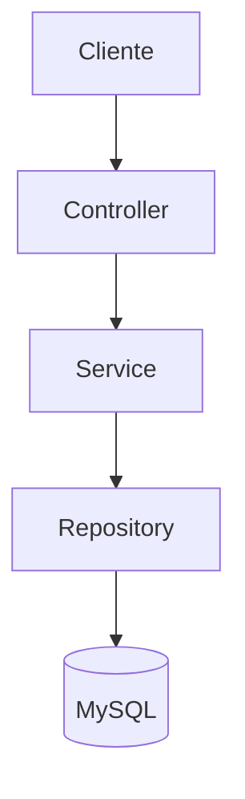
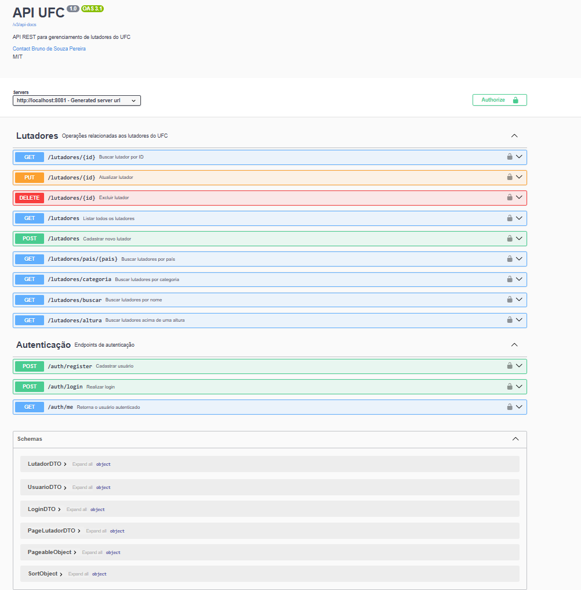

# 🥊 UFC API


API REST desenvolvida com **Spring Boot** para gerenciamento de lutadores do UFC.

O projeto foi desenvolvido como portfólio para demonstrar conhecimentos em desenvolvimento Backend utilizando Java, Spring Boot, autenticação JWT, Docker, testes automatizados e deploy em nuvem.

## 📑 Índice

- 🚀 Demonstração
- 📖 Funcionalidades
- 🛠 Tecnologias
- 🏗 Arquitetura
- 📂 Estrutura
- 🔐 Autenticação
- 🚀 Como testar
- 🥊 Cadastro de lutador
- 🐳 Docker
- ☁ Deploy
- 🧪 Testes
- 📷 Imagens
- ⚙ Execução Local
- 👨‍💻 Autor
- 📄 Licença

---

# 🚀 Demonstração

## API Online

https://ufc-api-chk7.onrender.com

## Swagger

https://ufc-api-chk7.onrender.com/swagger-ui/index.html

---

# 📖 Funcionalidades

- Cadastro de usuários
- Login utilizando JWT
- Cadastro de lutadores
- Atualização de lutadores
- Exclusão de lutadores
- Busca por ID
- Busca por nome
- Busca por país
- Busca por categoria
- Busca por altura
- Paginação
- Documentação Swagger
- Tratamento global de exceções

---

# 🛠 Tecnologias utilizadas

- Java 21
- Spring Boot
- Spring Security
- Spring Data JPA
- JWT
- MySQL
- Maven
- Docker
- Docker Compose
- Swagger / OpenAPI
- JUnit 5
- Mockito
- JaCoCo
- Railway
- Render
- Git
- GitHub

---

# 🏗 Arquitetura



O projeto utiliza arquitetura em camadas seguindo as boas práticas do Spring Boot.

---

# 📂 Estrutura do projeto

```
src
├── main
│   ├── controller
│   ├── service
│   ├── repository
│   ├── dto
│   ├── mapper
│   ├── model
│   ├── security
│   ├── config
│   └── exception
│
└── test
    ├── controller
    ├── service
    ├── security
    └── exception
```

---

# 🔐 Autenticação

A API utiliza autenticação **JWT (Bearer Token)**.

Os endpoints protegidos exigem autenticação.

Endpoints públicos:

- POST /auth/register
- POST /auth/login
- Swagger
- OpenAPI

---

# 🚀 Como testar a API

## 1. Acesse o Swagger

https://ufc-api-chk7.onrender.com/swagger-ui/index.html

---

## 2. Cadastre um usuário

POST

```
/auth/register
```

Exemplo

```json
{
  "username": "bruno",
  "password": "123456",
  "role": "ADMIN"
}
```

Clique em **Execute**.

---

## 3. Faça Login

POST

```
/auth/login
```

Exemplo

```json
{
  "username": "bruno",
  "password": "123456"
}
```

A resposta será semelhante a:

```json
{
  "token":"eyJhbGciOiJIUzI1NiJ9..."
}
```

Copie o valor do token(Sem as aspas).

---

## 4. Autorize no Swagger

Clique em

```
Authorize
```

Cole o token

```
eyJhbGciOiJIUzI1NiJ9...
```

Clique em

```
Authorize
```

Depois

```
Close
```

Agora todos os endpoints protegidos poderão ser utilizados.

---

# 🥊 Exemplo de cadastro de lutador

POST

```
/lutadores
```

```json
{
  "nome":"Anderson Silva",
  "pais":"Brasil",
  "categoria":"Peso Médio",
  "altura":1.88
}
```

---

# 🐳 Docker

Imagem disponível no Docker Hub

```
docker pull bruno9515/ufc-api:1.0.0
```

---

# ☁ Deploy

## Aplicação

Render

https://render.com

## Banco de Dados

Railway

https://railway.app

---

# 🧪 Testes

O projeto possui testes automatizados utilizando:

- JUnit 5
- Mockito
- Spring Boot Test

Cobertura de testes superior a **90%** utilizando JaCoCo.

---

# 📷 Imagens

## Swagger



---

## Postman


---

## Docker


---

## Cobertura JaCoCo


---

# ⚙ Como executar localmente

Clone o projeto

```bash
git clone https://github.com/Bruno9512/ufc-api.git
```

Entre na pasta

```bash
cd ufc-api
```

Execute o Docker Compose

```bash
docker compose up -d
```

Execute a aplicação

```bash
mvn spring-boot:run
```

Swagger

```
http://localhost:8081/swagger-ui/index.html
```

---


---

# 👨‍💻 Autor

**Bruno de Souza Pereira**

LinkedIn

www.linkedin.com/in/bruno-de-souza-pereira-0b1156355

GitHub

https://github.com/Bruno9512

Docker Hub

https://hub.docker.com/u/bruno9515

---

# 📄 Licença

Este projeto está licenciado sob a licença MIT.
